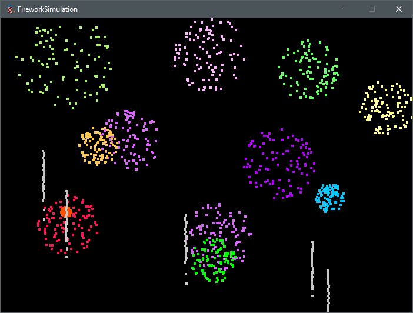

# FireworkSimulation

Eine Feuerwerk Simulation in Python/Pygame. Raketen steigen auf, driften realistisch und explodieren in farbigen Partikeln.

## Features

- Raketen mit Aufstiegsanimation
- Zufällige Drift-Bewegung
- Farbige Explosionen mit Partikeln

## Projektstruktur
```
FireworkSimulation/
│
├── src/
│   ├── main.py
│   ├── rocket.py
│   ├── firework.py
│   ├── drift.py
│   ├── colors.py
│   ├── paths.py
│   └── settings.py
│
├── assets/
│   ├── screenshot.png
│   ├── Icon.ico
│   └── explosion.mp3
│
└── README.md
```
## Screenshot



## Steuerung

- mit der Maus, wird die Position der Explosion bestimmt
- mit der linken Maustaste wird das Feuerwerk gestartet

## Installation

1. Python installieren
2. Pygame installieren mit pip install pygame
4. Projekt starten, indem src/main.py ausgeführt wird

Tobias — Python Entwickler  
GitHub: https://github.com/tobitechdev
